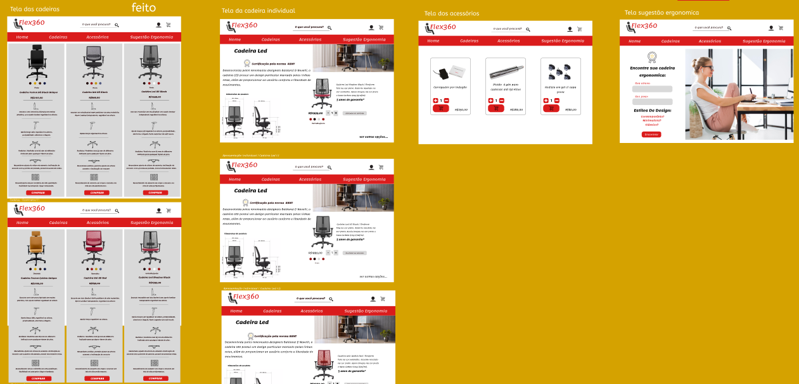
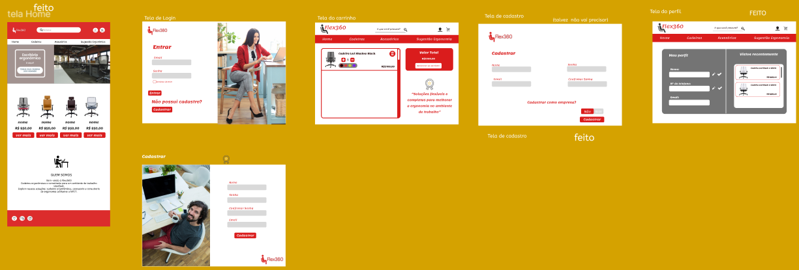

# Flex360 - E-commerce de Cadeiras Ergonômicas

## Apresentação

O Flex360 é um e-commerce especializado em cadeiras ergonômicas, com foco em oferecer opções adequadas para diferentes tipos de usuários, incluindo pessoas obesas. O sistema conta com funcionalidades de cadastro, login, navegação de produtos, sugestões ergonômicas e carrinho de compras.

## Capturas de Tela

### Telas





## Requisitos Funcionais

1. **Apresentação da Empresa**: Exibir uma página de apresentação da Flex360, destacando o e-commerce de cadeiras ergonômicas, incluindo opções para pessoas obesas.
2. **Cadastro de Usuário**: Permitir o cadastro de usuários com os campos:
   - Nome
   - E-mail
   - Senha e confirmação de senha
3. **Login de Usuário**: Permitir login com e-mail e senha. Se o usuário já estiver cadastrado, deve poder acessar a página de login através de um botão "Entrar".
4. **Navegação do E-commerce**: Permitir que o usuário visualize todas as cadeiras disponíveis e, ao clicar em "Comprar", redirecioná-lo para a página do produto.
5. **Adicionar ao Carrinho**: Permitir que o usuário adicione uma cadeira ao carrinho de compras a partir da página do produto.
6. **Página do Carrinho**: Exibir os itens adicionados ao carrinho, permitindo a remoção ou alteração de quantidade.
7. **Finalizar Compra**: Permitir a finalização da compra com um alerta de "Compra finalizada".
8. **Visualização de Acessórios**: Exibir acessórios disponíveis e permitir a adição desses itens ao carrinho.
9. **Página de Sugestão Ergonômica**: Permitir que o usuário insira altura e peso para receber recomendações personalizadas de cadeiras.
10. **Página de Perfil do Usuário**: Exibir nome, telefone, e-mail e cadeiras visualizadas recentemente.

## Requisitos Não Funcionais

1. **Segurança**:
   - Armazenamento seguro de senhas (usando técnicas de hash).
   - Validação de senha com critérios mínimos (mínimo de 8 caracteres, combinação de letras, números e símbolos).
2. **Performance**:
   - O tempo de carregamento da página inicial e de produtos não deve exceder 3 segundos.
   - Suporte para um grande número de acessos simultâneos sem perda de performance.
3. **Usabilidade**: Interface intuitiva, com navegação clara e simplificada.
4. **Compatibilidade**: Suporte para os principais navegadores modernos (Chrome, Firefox, Safari, Edge) em desktop e dispositivos móveis.
5. **Escalabilidade**: Suporte para futuras adições de produtos e funcionalidades sem grandes reestruturações.

## Como Executar

1. Clone este repositório:
   ```bash
   git clone https://github.com/seuusuario/flex360.git
